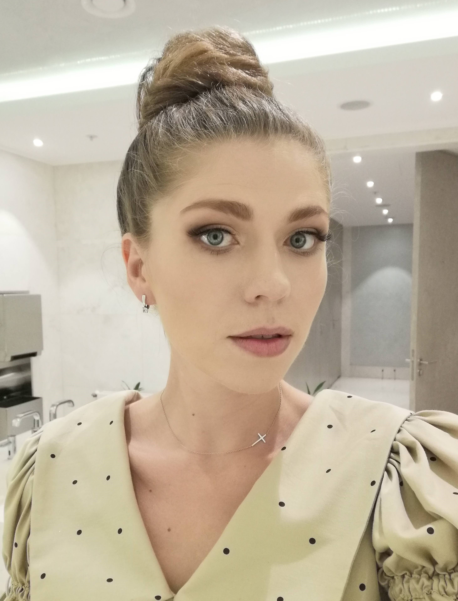

# Maryna Uhlianitsa
******************
## Contacts:
* tel. +375447617931
* e-mail: marinauglanica@gmail.com
* discord: shipy4ka
* instagram: marina_uglyanica
*******************
## About me:
I'm starting my way at JS.

My main purpose at this moment find out the key for freedomfrom political circumstances and other global problems.
My first education help me to found out the main skill of my life it's an aptitude to find out information about everything I need or want.
I have various work expierence: first of all I'm a lawyer. 
I have bachelor degree in law and work expierence in Human Resources department, soule  lawyer of company, law consultant in different fields of law. 
At studies time I had experience in HoReCa and selling. 
That experience help me to communicate with different kinds of people and first of all help me understand how to make this communication usefull for both. 
***********
## Skills:
* HTML-begginer
* CSS-begginer
* Git-begginer
******************
## Code:
This code I use only as demonstration that I can put it in HTML document.
```
function multiply (a,b) {
         return a*b;
}
```
*****************
## Projects:
I had no projects before this time.
[My first project.](https://shipy4ka.github.io/rsschool-cv/ "CV")
*****************
## Education
Law faculty of Belarussian State University
****************
## English
My English level is somewhere between B1 Intermediate and B2 Upper Intermediate according to the CEFR.